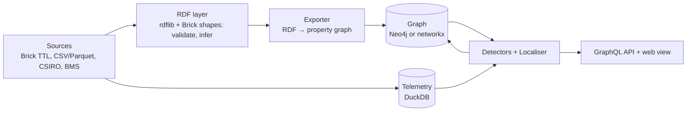

# Architecture

Five layers. RDF is the system of record for the building model; Neo4j (or the in-memory twin) is the query and
serving graph; telemetry lives in a columnar store. Detectors never touch raw files and the API never touches RDF.

## Why two graph representations

Brick is an RDF ontology: validation (SHACL shapes) and inference (a `Zone_Air_Temperature_Sensor` *is a*
`Temperature_Sensor` *is a* `Point`) are RDF operations and the tooling for them is RDF tooling. Localisation is a
traversal problem — walk from a point up to the equipment that serves it, look at siblings, rank — and that is
what a property graph and Cypher are built for. So the model is validated and inferred once in RDF, exported as
typed nodes and edges, and never edited in the property graph. A model change means re-validate and re-export;
the exporter is idempotent (`MERGE` on URI).

## Mapping (RDF → property graph)

| RDF | Property graph |
| --- | --- |
| entity with `rdf:type brick:X` | node with label `X` (most specific class), `classes` = full inferred class list, `uri`, `name` (rdfs:label), `unit` |
| `brick:hasPoint` / `isPointOf` | `HAS_POINT` / `IS_POINT_OF` |
| `brick:feeds` / `isFedBy` | `FEEDS` / `IS_FED_BY` |
| `brick:hasPart` / `isPartOf` | `HAS_PART` / `IS_PART_OF` |
| `brick:hasLocation` / `isLocationOf` | `HAS_LOCATION` / `IS_LOCATION_OF` |
| — | `Alert` nodes, `IMPLICATES {rank, score, reason}` and `EVIDENCED_BY` edges written by the localiser |

Both backends implement `graph/backend.py::GraphBackend`; the test suite runs against the in-memory one and the
CI `neo4j-integration` job runs export + detection against a real Neo4j service.

## Localisation

1. **Chain** — `equipment_chain(point)`: BFS over `IS_POINT_OF | IS_PART_OF | IS_FED_BY` up to 4 hops, nearest
   first. In Cypher: `MATCH path=(p)-[:IS_POINT_OF|IS_PART_OF|IS_FED_BY*1..4]->(e) ... ORDER BY min(length(path))`.
2. **Siblings** — other points on the same owner that are anomalous in the same window. Two or more ⇒ the
   fault is on the unit, not the sensor.
3. **Scoring** — distance prior `1/(1+d)`; +1 for the zone on zone-level IEQ symptoms; +1 for the damper on a
   command/position mismatch; +1 for the building on a main-meter anomaly; +1 for an owner with anomalous
   siblings; +1.5 for the AHU when the same symptom fires in two or more zones it serves.

The result is an `Alert` with ranked suspects (each with a one-line reason) and the depth-2 evidence subgraph
around the trigger point, returned as a node/edge list and as a JSON-LD view keyed by Brick URI.
